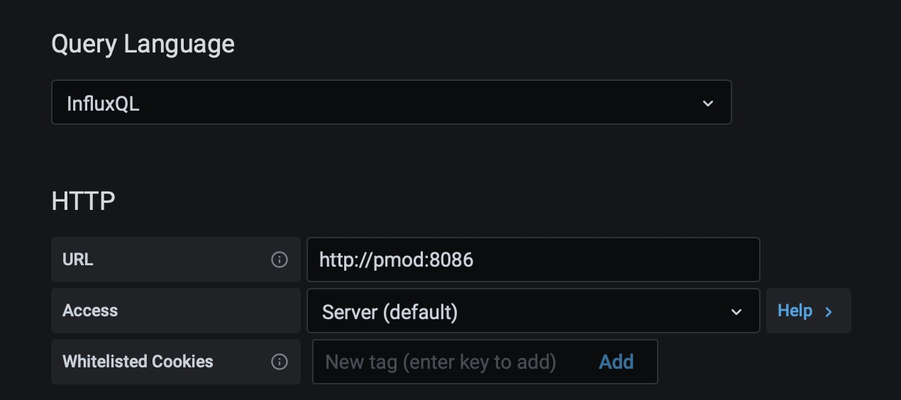

# FUDGE: a frugal edge node for IoT deployment in remote areas (v2.0)

Version 2.0:
* upgrading to Mosquitto 2.0 and containerizing it
* keeping InfluxDB 1.8
* orchestrating startup with Docker Compose

The growing connection between the Internet of Things (IoT) and Artificial Intelligence (AI) poses many challenges that require novel approaches and even a rethinking of the entire communication and processing architecture to meet new requirements for latency, reliability, power consumption and resource usage. Edge computing  is a promising approach to meet these challenges that can also be beneficial in delivering advanced AI-based IoT solutions in areas where connectivity is scarce and resources are generally limited.

With FUDGE, we introduce an edge/fog generic architecture to allow the adoption of edge solutions in IoT deployments in poorly connected and resource limited scenarios. To this end, we integrate, using micro-services, an MQTT based system that can collect ingress data, handle their persistency, and coordinate data integration with the cloud using a specific service called **aggregator**.  

The edge stations have a dedicated channel with the aggregator based on LoRa to enable long-range transmissions with low power consumption. This part of another project called [LoRaCTP.](https://github.com/pmanzoni/loractp)

More details here: https://dl.acm.org/doi/10.1145/3410670.3410857

## Required environment to execute a FUDGE

The required environment to execute a FUDGE consists of:

* Python3 (typically already available in the current Raspberry distributions), plus must be installed:
    - the [paho-mqtt](https://pypi.org/project/paho-mqtt/) library;
    - the Python [influxdb client](https://github.com/influxdata/influxdb-python) library.
        * basically done with: `pip3 install influxdb` 
* [Docker](https://docs.docker.com/get-docker/) platform.
    - The instructions for the [Raspberry Pi](https://www.raspberrypi.org/blog/docker-comes-to-raspberry-pi/), basically:
        - `curl -sSL https://get.docker.com | sh`
        - `sudo usermod -aG docker pi`

## Starting up the basic modules
The basic components are executed with command: `$ docker compose up`
They are: 
* Mosquitto broker
* influxDB
* Grafana

*If you want to run the services in the background add -d. To exit you can press CTRL-C.* The details can be found in file `docker-compose.yml`

To connect Grafana with InfluxDB, log into Grafana using a web browser:
* Address: http://127.0.0.1:3000/login
* Username: admin
* Password: admin

_Grafana will require you to change the password._

Add the InfluxDB data source using the following parameters: 

and: 

_password is defined in the `docker-compose.yml`_, and click on `Save & Test`. 

Finally, you must manually execute the persistency manager:
* $ python3 pman.py

## Basic content sources

We provide two basic "content sources" so to understand the basic structure of the code when adding any of these. 

### cs_sysdata
Gets some basic statistics about the FUDGE hardware (the Raspberry Pi)

### cs_localbroker
Gets some basic statistics about the Mosquitto broker.
